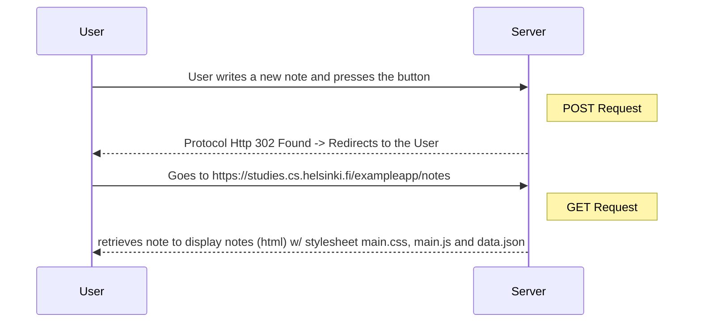
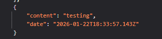

```mermaid
sequenceDiagram
    participant User
    participant Server

    User->>Server: User writes a new note and presses the button
    Note right of Server: POST Request
    Server-->>User: Protocol Http 302 Found -> Redirects to the User
    User->>Server: Goes to https://studies.cs.helsinki.fi/exampleapp/notes
    Note right of Server: GET Request
    Server-->>User: retrieves note to display notes (html) w/ stylesheet main.css, main.js and data.json
```
| SendingMessage | POST | GET | MESSAGE|
| :---: | :---: | :---:| :---:|
|| | ||
